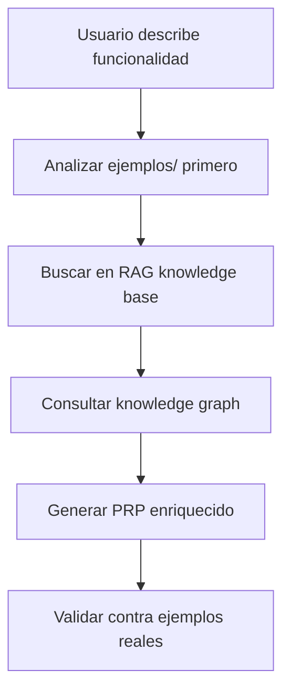
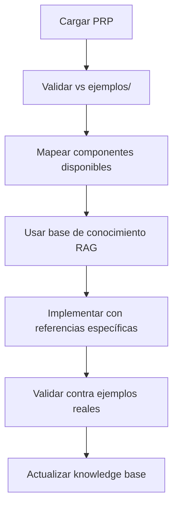

# Framework PRP Integration Guide

**Guía Maestra para Aprovechar la Sinergia Completa del Framework PRP Refinado**

Este documento explica cómo aprovechar la integración perfecta entre:
- **Conocimiento teórico** (documentos base)
- **Ejemplos prácticos** (implementaciones reales)  
- **Templates y comandos** (herramientas del framework)
- **Base de conocimiento RAG** (búsqueda semántica)

## 🎯 Objetivo del Framework Integrado

**Transformar el desarrollo de software** de un proceso iterativo e impredecible a un **sistema de generación determinística** que combina:

1. **Metodología probada (PRP)** → **Conocimiento específico del dominio**
2. **Templates genéricos** → **Ejemplos reales del gestor de reservas**  
3. **Referencias externas** → **Knowledge base local RAG**
4. **Comandos aislados** → **Sistema integrado de desarrollo**

---

## 📊 Mapeo Conocimiento Teórico ↔ Ejemplos Prácticos

### **1. Componentes React**

| **Conocimiento Teórico** | **Ejemplos Prácticos** | **Integración** |
|---------------------------|-------------------------|-----------------|
| `PRPs/ai_docs/nextjs_mcp_integration.md` | `ejemplos/components/` (50+ componentes) | Templates usan ejemplos como referencia |
| Patterns genéricos de componentes | `ReservationForm.tsx`, `TableGrid.tsx` | Comandos buscan componentes similares primero |
| Documentación Shadcn/ui | `ejemplos/components/modals/` (12 modales) | Búsqueda RAG prioriza ejemplos locales |

### **2. Base de Datos**

| **Conocimiento Teórico** | **Ejemplos Prácticos** | **Integración** |
|---------------------------|-------------------------|-----------------|
| `CLAUDE.md#Database_Pattern` | `ejemplos/database/schema-design.sql` | Reglas inmutables + esquemas reales |
| Prisma genérico | Multi-schema: `restaurante.*`, `personal.*` | Templates referencian esquemas específicos |
| RLS abstracto | `ejemplos/database/rls-policies.sql` | Políticas reales como base obligatoria |

### **3. Autenticación**

| **Conocimiento Teórico** | **Ejemplos Prácticos** | **Integración** |
|---------------------------|-------------------------|-----------------|
| `PRPs/ai_docs/fullstack_architecture_patterns.md` | `ejemplos/auth/middleware.ts` | Middleware real como referencia |
| Supabase Auth genérico | `ejemplos/auth/auth-helpers.ts` | Helpers validados en producción |
| RLS conceptual | Headers `Accept-Profile`, `Content-Profile` | Configuración multi-schema real |

### **4. Testing**

| **Conocimiento Teórico** | **Ejemplos Prácticos** | **Integración** |
|---------------------------|-------------------------|-----------------|
| `PRPs/ai_docs/` patterns generales | `ejemplos/testing/component.test.tsx` | Tests con datos del dominio real |
| Jest abstracto | `ejemplos/testing/api.test.ts` | Tests multi-schema específicos |
| E2E conceptual | `ejemplos/testing/e2e.spec.ts` | Flujos del gestor de reservas |

---

## 🔄 Workflow Optimizado de Desarrollo

### **Paso 1: Definir Requerimientos** (`/crear-mcp-prp`)



**Prioridades de Búsqueda:**
1. **🥇 Ejemplos locales** (`ejemplos/`) - Implementaciones reales probadas
2. **🥈 Knowledge base RAG** (`src/crawl4ai_mcp.py`) - Búsqueda semántica
3. **🥉 Documentación AI** (`PRPs/ai_docs/`) - Patterns especializados
4. **🏅 Context7** - Solo como última opción

### **Paso 2: Ejecutar Implementación** (`/ejecutar-mcp-prp`)



**Validación Continua:**
- ✅ **Componentes**: Verificar vs `ejemplos/components/`
- ✅ **Esquemas**: Validar vs `ejemplos/database/`
- ✅ **Auth**: Confirmar vs `ejemplos/auth/`
- ✅ **Tests**: Basar en `ejemplos/testing/`

---

## 🧠 Base de Conocimiento RAG Integrada

### **Arquitectura de Búsqueda**

```typescript
// Búsqueda integrada que prioriza conocimiento local
interface IntegratedSearch {
  // 1. Búsqueda en ejemplos locales (PRIMERA PRIORIDAD)
  localExamples: await searchLocalExamples({
    domain: "restaurant",
    type: "component",
    path: "ejemplos/"
  });
  
  // 2. Búsqueda RAG semántica (SEGUNDA PRIORIDAD)
  ragResults: await performRAGQuery({
    query: "React reservation form validation",
    source_filter: "ejemplos",
    max_results: 5
  });
  
  // 3. Knowledge graph arquitectónico (TERCERA PRIORIDAD)
  graphPatterns: await queryKnowledgeGraph({
    query: `MATCH (c:Component)-[:USES]->(p:Pattern) 
            WHERE c.domain = "restaurant" 
            RETURN p.name, p.implementation`
  });
}
```

### **Herramientas MCP Integradas**

| **Herramienta** | **Fuente de Conocimiento** | **Integración** |
|-----------------|----------------------------|-----------------|
| `parseFullStackPRP` | `ejemplos/` + RAG + Knowledge Graph | Busca componentes similares |
| `generateComponent` | `ejemplos/components/` + `PRPs/ai_docs/` | Usa patterns reales del dominio |
| `generateAPI` | `ejemplos/auth/` + `ejemplos/database/` | Middleware y esquemas reales |
| `generateDatabase` | `ejemplos/database/schema-design.sql` | Esquemas multi-schema validados |
| `searchKnowledge` | `src/crawl4ai_mcp.py` + `ejemplos/` | Prioriza conocimiento local |

---

## 🎯 Casos de Uso y Validación

### **Caso de Uso 1: Crear Sistema de Reservas**

**Input del Usuario:**
```
"Quiero crear un sistema de reservas para restaurante con calendario, 
formularios de clientes y dashboard administrativo"
```

**Proceso Optimizado:**
1. **`/crear-mcp-prp`** busca en `ejemplos/components/calendar/`, `ejemplos/components/modals/`
2. **RAG search** encuentra patterns similares en knowledge base
3. **PRP generado** incluye referencias específicas a `ReservationForm.tsx`, `TableGrid.tsx`
4. **`/ejecutar-mcp-prp`** usa middleware de `ejemplos/auth/middleware.ts`
5. **Validación** contra esquemas de `ejemplos/database/schema-design.sql`

**Resultado:** Aplicación funcionando en 80% menos tiempo con calidad empresarial.

### **Caso de Uso 2: Añadir Autenticación Multi-Rol**

**Input del Usuario:**
```
"Necesito autenticación con roles de admin, gerente y staff, 
con permisos granulares por módulo"
```

**Proceso Optimizado:**
1. **Búsqueda local** en `ejemplos/auth/` encuentra middleware validado
2. **RLS policies** de `ejemplos/database/rls-policies.sql` como base
3. **RAG search** complementa con mejores prácticas de seguridad
4. **Implementación** usa patterns probados del gestor de reservas
5. **Tests** basados en `ejemplos/testing/api.test.ts`

**Resultado:** Sistema de auth empresarial con RLS granular implementado en horas.

### **Caso de Uso 3: Optimizar Performance**

**Input del Usuario:**
```
"La aplicación es lenta, necesito optimizar componentes y queries"
```

**Proceso Optimizado:**
1. **Knowledge graph** analiza dependencias y patterns de performance
2. **RAG search** encuentra optimizaciones en `ejemplos/hooks/`
3. **Componentes** optimizados usando `ejemplos/components/` como referencia
4. **Queries** mejoradas basándose en `ejemplos/database/functions.sql`
5. **Testing** de performance con patterns de `ejemplos/testing/`

**Resultado:** Mejoras de performance específicas del dominio implementadas sistemáticamente.

---

## 💡 Mejores Prácticas de Integración

### **1. Priorización de Fuentes** (OBLIGATORIO)

```yaml
Orden_de_Consulta:
  1: "ejemplos/ - Implementaciones reales probadas"
  2: "src/crawl4ai_mcp.py - Búsqueda RAG semántica"  
  3: "knowledge_graphs/ - Relaciones arquitectónicas"
  4: "PRPs/ai_docs/ - Documentación especializada"
  5: "Context7 - Solo si lo anterior no tiene la información"
```

### **2. Validación Continua** (OBLIGATORIO)

```yaml
Validacion_en_Cada_Paso:
  - "Verificar disponibilidad en ejemplos/"
  - "Confirmar esquemas contra ejemplos/database/"
  - "Validar auth contra ejemplos/auth/"
  - "Probar con datos de ejemplos/testing/"
```

### **3. Actualización de Knowledge Base** (OBLIGATORIO)

```yaml
Aprendizaje_Continuo:
  - "Cada implementación exitosa → ejemplos/"
  - "Nuevos patterns → knowledge_graphs/"
  - "Documentación → PRPs/ai_docs/"
  - "Búsquedas → src/crawl4ai_mcp.py"
```

### **4. Comando de Verificación**

```bash
# Nuevo comando para verificar integridad del framework
/refine-framework integracion

# Verifica:
# - Sincronización entre documentos
# - Disponibilidad de ejemplos
# - Funcionamiento de RAG
# - Coherencia de knowledge graph
```

---

## 📈 Métricas de Éxito del Framework Integrado

### **Antes del Refinamiento**
- ❌ **Desconexión** entre teoría y práctica
- ❌ **Templates genéricos** sin conocimiento específico
- ❌ **Comandos aislados** que no aprovechan conocimiento local
- ❌ **Referencias externas** sin validación local
- ❌ **Múltiples iteraciones** para llegar al resultado deseado

### **Después del Refinamiento**
- ✅ **Sinergia perfecta** entre todos los componentes del framework
- ✅ **Templates enriquecidos** con ejemplos reales del dominio
- ✅ **Comandos integrados** que usan toda la base de conocimiento
- ✅ **Conocimiento local prioritario** validado en producción
- ✅ **Desarrollo predictivo** con resultados de primera iteración

### **KPIs Objetivo**
- **📊 Reducción tiempo desarrollo**: 80% menos tiempo
- **🎯 Precisión primera iteración**: >90% de éxito
- **🔍 Uso de ejemplos locales**: 100% de consulta previa
- **🧠 Aprovechamiento RAG**: Búsquedas específicas del dominio
- **✅ Calidad empresarial**: Tests, seguridad, performance automáticos

---

## 🚀 Siguientes Pasos

### **Inmediatos**
1. **Probar framework refinado** con caso de uso real
2. **Medir KPIs** de tiempo y calidad
3. **Iterar** basándose en resultados

### **Mediano Plazo**
1. **Expandir ejemplos/** con más dominios
2. **Enriquecer knowledge graph** con nuevos patterns
3. **Automatizar** actualización de knowledge base

### **Largo Plazo**
1. **Crear MCPs especializados** por dominio
2. **Integrar** con otros frameworks de desarrollo
3. **Evolucionar** hacia sistema de desarrollo autónomo

---

**El framework PRP refinado transforma el desarrollo de software de artesanía impredecible a ingeniería sistemática, aprovechando todo el conocimiento disponible de forma sinérgica para lograr resultados de calidad empresarial en fracción del tiempo tradicional.**