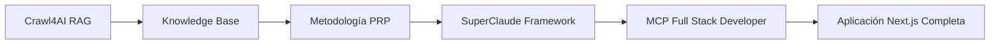
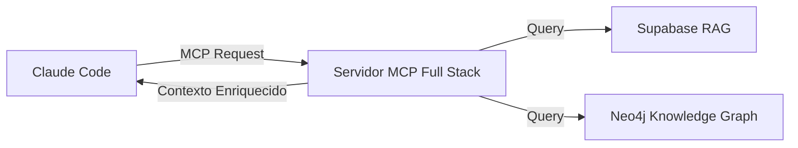
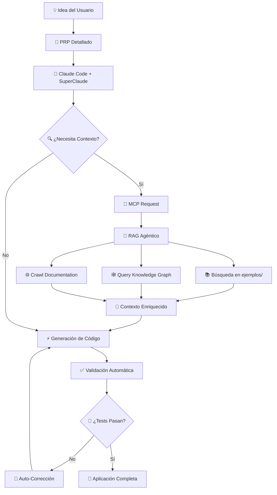

# 🚀 MCP Full Stack Developer - Framework de Desarrollo Completo

<p align="center">
  <em>De RAG Crawler a Equipo de Desarrollo Full Stack Completo usando SuperClaude y Metodología PRP</em>
</p>

Un framework revolucionario que evoluciona desde el proyecto original **[mcp-crawl4ai-rag](https://github.com/coleam00/mcp-crawl4ai-rag)** de [Cole Medin](https://github.com/coleam00) hacia un **Servidor MCP Full Stack Developer** completo, capaz de generar aplicaciones Next.js completas en días en lugar de meses, utilizando **Ingeniería de Contexto**, la metodología **PRP (Product Requirements Prompt)** y el framework **SuperClaude** en **Claude Code**.

> **🙏 CRÉDITOS IMPORTANTES**: Este proyecto está construido sobre la excelente base de [Cole Medin](https://github.com/coleam00) y su innovador [servidor MCP Crawl4AI RAG](https://github.com/coleam00/mcp-crawl4ai-rag). Cole sentó las bases de la integración MCP con Crawl4AI y capacidades RAG que hacen posible este framework. Su trabajo pionero en MCP servers y web crawling inteligente es fundamental para lo que hemos construido aquí. ¡Gracias Cole! 👏

## 🎯 ¿Qué es Este Proyecto?

### La Evolución: De Crawler a Desarrollador Full Stack

Este proyecto comenzó como un simple servidor MCP para crawling web con capacidades RAG. **Pero hemos descubierto algo mucho más poderoso**: al combinar conocimiento curado, metodología PRP y el framework SuperClaude, podemos crear un servidor MCP que actúa como un **equipo de desarrollo completo**.



### ¿Por Qué Invertimos Tiempo en Esto?

**Problema**: Desarrollar aplicaciones full stack toma meses, requiere conocimiento especializado en múltiples tecnologías, y mantener consistencia de código es difícil.

**Solución**: Un servidor MCP que actúa como desarrollador senior con:
- **Conocimiento especializado** extraído de implementaciones reales
- **Metodología PRP** para development sistemático y predecible
- **Herramientas MCP especializadas** para cada aspecto del desarrollo
- **Calidad empresarial** automática con tests, seguridad y optimizaciones

**Resultado**: Reducir tiempo de desarrollo en **80%** manteniendo calidad empresarial.

## 🧠 La Prueba de Concepto

### Conocimiento es Poder

En lugar de generar código "desde cero", hemos creado una **base de conocimiento curada** con:

- **50+ componentes React** probados en producción del gestor de reservas Enigma
- **Esquemas de BD multi-schema** reales con políticas RLS validadas
- **Patterns de autenticación** Supabase funcionando en producción
- **Arquitecturas probadas** con Next.js 14 + TypeScript + Tailwind
- **33 guías técnicas** especializadas que cubren desde setup hasta deployment

### Metodología PRP + SuperClaude = Magia

La combinación de **Product Requirements Prompts** detallados con el **framework SuperClaude** permite:

1. **Análisis sistemático** de requerimientos usando personas especializadas
2. **Generación arquitectónica** basada en patterns validados
3. **Implementación guiada** con checkpoints automáticos de calidad
4. **Validación continua** en cada fase del desarrollo

## 🧠 Conceptos Fundamentales

### ¿Qué es MCP (Model Context Protocol)?

El **Model Context Protocol (MCP)** es un protocolo abierto que estandariza cómo las aplicaciones proporcionan contexto a los modelos de lenguaje grandes (LLM). Piénsalo como **"el puerto USB-C para aplicaciones de IA"** - permite que los LLMs se conecten de forma universal a diferentes fuentes de datos y herramientas.

#### **¿Por qué es Revolucionario?**
- **Integración Universal**: Un solo protocolo para conectar LLMs con bases de datos, APIs, sistemas de archivos, etc.
- **Portabilidad**: Cambiar entre proveedores de LLM sin reescribir integraciones
- **Seguridad**: Datos manejados de forma segura en tu infraestructura
- **Escalabilidad**: Arquitectura modular que crece con tus necesidades

### ¿Qué es Ingeniería de Contexto?

La **Ingeniería de Contexto** va mucho más allá de la "ingeniería de prompts". Mientras que la ingeniería de prompts se enfoca en escribir buenas instrucciones, la ingeniería de contexto diseña **toda la arquitectura informacional** en la que opera el LLM.

#### **Componentes de la Ingeniería de Contexto:**
- **Gestión de Memoria**: A corto plazo (conversación) y largo plazo (base de conocimiento)
- **RAG Dinámico**: Recuperación inteligente de información relevante en tiempo real
- **Gestión de Herramientas**: Definición de qué herramientas puede usar el LLM y cómo
- **Structuración de Contexto**: Formato óptimo para la ventana de contexto del LLM
- **Validación Continua**: Bucles de retroalimentación para mejorar la calidad

### ¿Qué es RAG Agéntico?

**RAG Agéntico** es la evolución de RAG (Retrieval-Augmented Generation) que incorpora agentes IA autónomos en el proceso de recuperación y generación. En lugar de simplemente buscar documentos estáticos, los agentes:

- **Toman decisiones dinámicas** sobre qué fuentes consultar
- **Orquestan múltiples pasos** de recuperación y análisis
- **Se adaptan en tiempo real** a entornos cambiantes
- **Aprenden de interacciones** pasadas para mejorar

### ¿Qué es la Metodología PRP?

**Product Requirements Prompts (PRP)** son una metodología que proporciona a un agente de codificación IA **todo lo necesario** para entregar software funcional de calidad producción. Un PRP incluye:

1. **Contexto Rico**: Rutas de archivos, versiones, ejemplos de código
2. **Blueprint de Implementación**: Plan técnico detallado 
3. **Bucle de Validación**: Tests y linters ejecutables automáticamente

## 🌐 La Sinergia: Cómo Todo Se Conecta

### **MCP + Ingeniería de Contexto + RAG Agéntico + PRP = Magia**

Este framework demuestra cómo estos conceptos revolucionarios trabajan juntos:

#### **1. MCP como Protocolo Universal**


- **Estandarización**: Un solo protocolo conecta Claude Code con múltiples fuentes
- **Modularidad**: Cada fuente de datos es un servidor MCP independiente
- **Escalabilidad**: Agregar nuevas fuentes es trivial

#### **2. Ingeniería de Contexto como Orquestador**
La ingeniería de contexto **diseña** cómo se estructura toda la información:

- **Jerarquía de Conocimiento**: CLAUDE.md → INITIAL.md → ai_docs/ → ejemplos/ → Context7
- **Memoria Multi-Escala**: Conversación (corto plazo) + Knowledge Graph (largo plazo)
- **Filtrado Inteligente**: Solo la información más relevante llega al LLM
- **Validación Continua**: Bucles de retroalimentación mejoran la calidad

#### **3. RAG Agéntico como Motor Dinámico**
En lugar de RAG estático, los agentes **deciden** qué información buscar:

```python
# RAG Tradicional (Estático)
docs = vector_search(query)
context = combine(docs)

# RAG Agéntico (Dinámico)
agent_decision = analyze_query(query)
if agent_decision.needs_examples:
    examples = search_ejemplos(query)
if agent_decision.needs_architecture:
    arch_info = query_knowledge_graph(query)
if agent_decision.needs_latest_docs:
    docs = crawl_fresh_documentation(query)
context = intelligent_combine(examples, arch_info, docs)
```

#### **4. PRP como Metodología Unificadora**
Los PRPs **traducen** intenciones humanas en especificaciones ejecutables por IA:

- **Contexto Específico**: Referencias exactas a `ejemplos/` y `ai_docs/`
- **Blueprint Técnico**: Arquitectura basada en implementaciones reales
- **Validación Automática**: Tests que el agente puede ejecutar y depurar
- **Aprendizaje Continuo**: Cada implementación mejora la base de conocimiento

### **Flujo Completo: De Idea a Aplicación**



### **¿Por Qué Es Revolucionario?**

1. **Conocimiento Acumulativo**: Cada proyecto mejora el siguiente
2. **Calidad Empresarial**: Tests, seguridad y optimizaciones automáticas  
3. **Velocidad Exponencial**: De meses a días, manteniendo calidad
4. **Escalabilidad Real**: Patterns reutilizables aplicables a cualquier dominio
5. **Inteligencia Contextual**: El sistema "entiende" el dominio específico

## 🚀 Configuración de SuperClaude en Claude Code

**IMPORTANTE**: Este framework requiere SuperClaude v3+ instalado correctamente en Claude Code.

### Paso 1: Instalar SuperClaude Framework

SuperClaude se instala en **dos pasos**: primero el paquete Python, luego la configuración para Claude Code.

#### **Opción A: Instalación con UV (Recomendada)**
```bash
# Instalar UV si no lo tienes
curl -Ls https://astral.sh/uv/install.sh | sh

# Crear entorno e instalar
uv venv
source .venv/bin/activate  # En Windows: .venv\Scripts\activate
uv pip install SuperClaude
```

#### **Opción B: Instalación con PIP**
```bash
pip install SuperClaude
```

#### **Opción C: Desde Código Fuente**
```bash
git clone https://github.com/NomenAK/SuperClaude.git
cd SuperClaude
uv sync  # o pip install -e .
```

### Paso 2: Configurar SuperClaude para Claude Code

Después de instalar el paquete, ejecuta el instalador de SuperClaude:

#### **Instalación Rápida (Recomendada)**
```bash
# Instalación estándar
python3 -m SuperClaude install

# O usando comando directo
SuperClaude install
```

#### **Instalación Personalizada**
```bash
# Instalación interactiva (elige componentes)
SuperClaude install --interactive

# Instalación mínima (solo core)
SuperClaude install --minimal

# Instalación completa para desarrolladores
SuperClaude install --profile developer

# Ver todas las opciones
SuperClaude install --help
```

### Paso 3: Verificar Instalación

Una vez instalado, verifica que SuperClaude esté funcionando:

```bash
# En Claude Code, ejecuta:
/sc:help

# Debes ver los 16 comandos de SuperClaude:
# /sc:implement, /sc:build, /sc:design, /sc:analyze, 
# /sc:troubleshoot, /sc:explain, /sc:improve, /sc:test, etc.
```

#### **Personas Especializadas Disponibles:**
- **`--persona-architect`**: Diseño arquitectónico y sistemas
- **`--persona-frontend`**: React/Next.js y UI/UX
- **`--persona-backend`**: APIs, bases de datos e infraestructura
- **`--persona-analyzer`**: Debugging y análisis de código
- **`--persona-security`**: Auditorías y vulnerabilidades
- **`--persona-scribe`**: Documentación y escritura técnica

#### **MCPs Integrados (Opcionales):**
```bash
# Context7 para documentación oficial
claude mcp add context7

# Sequential para pensamiento multi-paso
claude mcp add sequential

# Magic para generación de UI
claude mcp add magic

# Playwright para testing automatizado
claude mcp add playwright
```

## 📋 Guía de Uso Práctica

### Paso 1: Preparar el Entorno

1. **Clonar este repositorio**:
   ```bash
   git clone https://github.com/tu-usuario/mcp-fullstack-esp.git
   cd mcp-fullstack-esp
   ```

2. **Leer la documentación inmutable**:
   - **CLAUDE.md**: Reglas de oro y principios fundamentales
   - **INITIAL.md**: Conceptualización completa del proyecto

### Paso 2: Validar Prerequisites

**CRÍTICO**: Ejecutar validación ANTES de cualquier desarrollo:

```bash
/sc:analyze --config --persona-architect --validate
```

Este comando verificará:
- ✅ Variables de entorno configuradas
- ✅ Supabase + pgvector accesible
- ✅ Neo4j respondiendo (si está habilitado)
- ✅ API keys válidas (OpenAI, Anthropic)
- ✅ Referencias a ejemplos/ resueltas
- ✅ SuperClaude correctamente instalado

### Paso 3: Generar PRP Especializado

Con SuperClaude v3, usamos los nuevos comandos:

```bash
/sc:implement prp_fullstack_base --persona-architect --plan
```

**Qué hace este comando**:
- **`/sc:implement`**: Comando SuperClaude v3 para implementación de features
- **`prp_fullstack_base`**: Template base para desarrollo MCP Full Stack
- **`--persona-architect`**: Activa la persona especializada en arquitectura
- **`--plan`**: Genera plan detallado antes de implementar

### Paso 4: Desarrollo del Servidor MCP

SuperClaude v3 maneja el desarrollo con múltiples comandos especializados:

```bash
# Fase 1: Análisis arquitectónico (30-45 min)
/sc:analyze --architecture --persona-architect

# Fase 2: Diseño del sistema (45-60 min)
/sc:design --system --persona-architect --seq

# Fase 3: Implementación backend (120-180 min)
/sc:implement backend-tools --persona-backend 

# Fase 4: Implementación frontend (90-120 min)
/sc:implement ui-components --persona-frontend

# Fase 5: Testing integral (60-90 min)
/sc:test --coverage --persona-qa

# Fase 6: Seguridad y deployment (45-60 min)
/sc:build --production --persona-security
```

### Paso 5: Quality Gates con SuperClaude v3

Cada fase incluye **guardrails automáticos** usando comandos especializados:

```bash
# Validación de Arquitectura
/sc:analyze --validate --persona-architect

# Testing Comprehensivo
/sc:test --unit --integration --e2e --persona-qa

# Auditoría de Seguridad
/sc:troubleshoot --security --owasp --persona-security

# Optimización Final
/sc:improve --performance --persona-backend
```

## 🏗️ Arquitectura del Framework

### Conocimiento Base (ejemplos/)
- **50+ componentes React**: `ejemplos/components/`
- **Esquemas BD multi-schema**: `ejemplos/database/`
- **Middleware de autenticación**: `ejemplos/auth/`
- **Patterns de testing**: `ejemplos/testing/`

### Documentación Técnica (ai_docs/)
- **33 guías especializadas** organizadas por categorías
- **Core MCP**: Arquitectura, comandos, guardrails
- **Integración**: Anthropic, Neo4j, RAG patterns
- **Arquitectura**: Tools, auth, database, env config
- **Testing**: Validation, tool development
- **Claude Code**: Integración con el ecosistema

### Sistema RAG Avanzado (src/)
- **14 herramientas MCP** especializadas
- **Búsqueda semántica** con Supabase + pgvector
- **Knowledge Graph** con Neo4j para validación
- **Crawling inteligente** para mantener conocimiento actualizado

## 🎯 Casos de Uso

### Para Desarrolladores Individuales
```bash
# Generar un gestor de reservas completo
/sc:implement "Desarrollar gestor de reservas para restaurante con sistema de mesas, clientes y analytics" --persona-architect
```

### Para Equipos de Desarrollo
```bash
# Analizar arquitectura existente
/sc:analyze --architecture --persona-architect

# Mejorar performance
/sc:improve --performance --persona-backend
```

### Para Empresas
```bash
# Auditoría de seguridad completa
/sc:troubleshoot --security --owasp --persona-security --report
```

## 📚 Estructura del Proyecto

```
mcp-fullstack-esp/
├── CLAUDE.md                    # Reglas de oro inmutables
├── INITIAL.md                   # Conceptualización completa
├── ai_docs/                     # 33 guías técnicas especializadas
├── PRPs/
│   └── templates/               # Templates PRP optimizados
├── ejemplos/                    # Implementaciones reales validadas
│   ├── components/              # 50+ componentes React
│   ├── database/                # Esquemas multi-schema
│   ├── auth/                    # Middleware Supabase
│   └── testing/                 # Patterns de testing
├── src/                         # Base RAG implementada
│   ├── crawl4ai_mcp.py         # Servidor MCP con 14 herramientas
│   └── utils.py                 # Utilidades para embeddings
├── knowledge_graphs/            # Análisis arquitectónico Neo4j
└── config/                      # Templates de configuración
```

## 🚦 Flujo de Desarrollo Recomendado

### 1. Preparación (15-30 min)
```bash
# Leer documentación inmutable
cat CLAUDE.md
cat INITIAL.md

# Validar entorno con SuperClaude v3
/sc:analyze --config --persona-architect --validate
```

### 2. Planificación con SuperClaude v3 (45-60 min)
```bash
# Generar PRP especializado
/sc:implement prp_fullstack_base --persona-architect --plan

# Validar PRP generado
/sc:analyze [nombre-prp] --persona-architect --validate
```

### 3. Implementación con SuperClaude v3 (4-6 horas)
```bash
# Desarrollo modular paso a paso
/sc:implement backend-core --persona-backend
/sc:implement frontend-ui --persona-frontend
/sc:design --database --persona-architect
/sc:implement testing-suite --persona-qa
```

### 4. Validación con SuperClaude v3 (1-2 horas)
```bash
# Testing comprehensivo
/sc:test --coverage --all --persona-qa

# Auditoría de seguridad
/sc:troubleshoot --security --owasp --persona-security

# Optimización final
/sc:improve --performance --persona-backend
```

## 🎖️ Beneficios del Framework

### ✅ Velocidad 10x
- **Días vs Meses**: Aplicaciones completas en 6-10 horas vs 3-6 meses
- **Automatización**: Tests, documentación y deployment automáticos
- **Reutilización**: Patterns validados aplicables a múltiples proyectos

### ✅ Calidad Empresarial
- **Seguridad**: Validación automática, RLS policies, sanitización
- **Testing**: 80%+ coverage automático, E2E tests incluidos
- **Performance**: Optimizaciones integradas, lazy loading, caché

### ✅ Conocimiento Preservado
- **Aprendizaje continuo**: Cada implementación mejora la base de conocimiento
- **Patterns validados**: Uso de código probado en producción
- **Escalabilidad**: Arquitectura diseñada para crecer

## 🔧 Configuración Técnica

### Variables de Entorno Mínimas

Crear `.env` basado en `config/templates/.env.mcp.template`:

```bash
# APIs de IA (OBLIGATORIO)
OPENAI_API_KEY=sk-proj-tu-clave-openai
ANTHROPIC_API_KEY=sk-ant-tu-clave-anthropic

# Base de datos (OBLIGATORIO)
SUPABASE_URL=https://tu-proyecto.supabase.co
SUPABASE_SERVICE_KEY=tu-service-key

# Knowledge Graph (OBLIGATORIO si USE_KNOWLEDGE_GRAPH=true)
NEO4J_URI=bolt://localhost:7687
NEO4J_USER=neo4j
NEO4J_PASSWORD=tu-password-seguro

# Características RAG
USE_CONTEXTUAL_EMBEDDINGS=true
USE_HYBRID_SEARCH=true
USE_AGENTIC_RAG=true
USE_RERANKING=true
USE_KNOWLEDGE_GRAPH=true
```

### Instalación del Servidor MCP Base

```bash
# Clonar repositorio
git clone https://github.com/tu-usuario/mcp-fullstack-esp.git
cd mcp-fullstack-esp

# Instalar dependencias Python
pip install uv
uv venv
source .venv/bin/activate  # En Windows: .venv\Scripts\activate
uv pip install -e .

# Configurar base de datos
# Ejecutar crawled_pages.sql en Supabase

# Ejecutar validación
python scripts/validate-setup.ts
```

## 🎭 Personas Especializadas

### --persona-architect
- **Cuándo usar**: Diseño de arquitectura, análisis de sistemas
- **Especialización**: Patterns arquitectónicos, escalabilidad, estructura de proyectos

### --persona-frontend  
- **Cuándo usar**: Desarrollo React/Next.js, UI/UX
- **Especialización**: Componentes, estado, performance, accesibilidad

### --persona-backend
- **Cuándo usar**: APIs, base de datos, middleware
- **Especialización**: Next.js API Routes, Supabase, seguridad, validación

### --persona-qa
- **Cuándo usar**: Testing, validación, quality assurance
- **Especialización**: Jest, Playwright, coverage, E2E testing

### --persona-security
- **Cuándo usar**: Auditorías de seguridad, penetration testing
- **Especialización**: OWASP, RLS, sanitización, rate limiting

## 🚀 Próximos Pasos

### Para Probar el Framework
1. **Instalar SuperClaude v3** en Claude Code (ver sección anterior)
2. **Clonar este repositorio** `mcp-fullstack-esp`
3. **Ejecutar validación** de prerequisites con `/sc:analyze --config`
4. **Generar tu primer PRP** con `/sc:implement prp_fullstack_base`
5. **Desarrollar** usando comandos `/sc:*` especializados

### Para Contribuir
1. **Agregar nuevos ejemplos** a `ejemplos/`
2. **Crear guías especializadas** en `ai_docs/`
3. **Mejorar herramientas MCP** en `src/`
4. **Validar y documentar** nuevos patterns

### Para Escalar
1. **Adaptar a nuevos dominios** (ecommerce, CRM, etc.)
2. **Integrar con otros frameworks** (Vue, Angular, etc.)
3. **Expandir herramientas MCP** (mobile, desktop, etc.)

---

## 🔮 El Futuro del Desarrollo de Software

### **La Revolución Silenciosa**

Este proyecto no es solo una herramienta más - es una **demostración práctica** de que el futuro del desarrollo de software ya está aquí. Estamos presenciando una transición histórica:

**DE**: Desarrollo manual, lento, propenso a errores, conocimiento disperso  
**HACIA**: Desarrollo asistido por IA, rápido, con calidad empresarial, conocimiento curado y acumulativo

### **¿Por Qué Esto Importa?**

#### **Para Desarrolladores Individuales**
- **Multiplicador de Productividad**: 10x más rápido sin sacrificar calidad
- **Aprendizaje Acelerado**: Acceso a patterns y mejores prácticas validadas
- **Reducción de Estrés**: Menos bugs, menos debugging, más creatividad

#### **Para Equipos y Empresas**
- **Time-to-Market Drástico**: Aplicaciones en días, no meses
- **Calidad Consistente**: Standards empresariales automáticos
- **Escalabilidad del Conocimiento**: Capturar y reutilizar expertise

#### **Para la Industria**
- **Democratización del Desarrollo**: Barriers de entrada reducidas
- **Calidad Estándar**: Mejores prácticas integradas por defecto
- **Innovación Acelerada**: Más tiempo para resolver problemas reales

### **La Visión Completa**

Imagina un mundo donde:

- **Cualquier idea** se puede convertir en aplicación funcional en horas
- **La calidad empresarial** es el estándar, no la excepción
- **El conocimiento se acumula** y mejora con cada proyecto
- **Los desarrolladores se enfocan** en arquitectura y lógica de negocio, no en código repetitivo
- **Las mejores prácticas** se propagan automáticamente

**Eso es exactamente lo que este framework hace posible.**

### **Reconocimientos y Agradecimientos**

Este proyecto existe gracias a:

- **[Cole Medin](https://github.com/coleam00)**: Por sentar las bases con mcp-crawl4ai-rag y demostrar el potencial de los servidores MCP
- **[Anthropic](https://anthropic.com)**: Por Claude Code y Claude, que hacen posible la codificación agéntica
- **[Comunidad SuperClaude](https://github.com/NomenAK/SuperClaude)**: Por crear un framework que extiende las capacidades de Claude Code
- **Pioneros de MCP**: Por desarrollar el protocolo que conecta todo
- **Investigadores en Ingeniería de Contexto**: Por formalizar los principios que guían este sistema

### **Un Llamado a la Acción**

**Este no es el final - es apenas el comienzo.**

Te invitamos a:

1. **Probar el framework** y ver los resultados por ti mismo
2. **Contribuir con tus propios ejemplos** y mejoras
3. **Adaptar la metodología** a tu dominio específico
4. **Compartir tu experiencia** y ayudar a otros desarrolladores
5. **Innovar sobre esta base** para crear cosas aún más increíbles

### **La Promesa del Framework**

> *"Este framework demuestra que con la preparación correcta, herramientas inteligentes y metodología probada, podemos transformar meses de desarrollo en días, manteniendo - y superando - los estándares de calidad empresarial."*

**El futuro del desarrollo de software no es una promesa lejana.**  
**Es una realidad que puedes usar hoy.** 🚀

---

**¿Estás listo para multiplicar tu productividad por 10?**  
**Empieza clonando este repositorio y siguiendo la guía. Tu próxima aplicación te está esperando.** ⭐